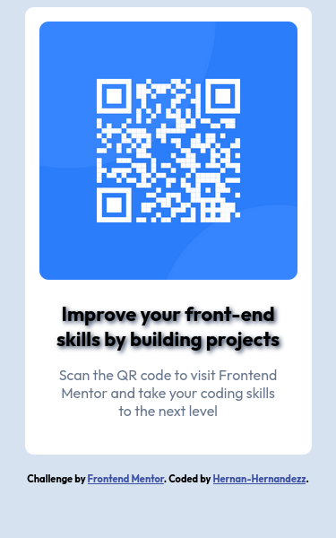

# Frontend Mentor - QR Code Component Solution

This is a solution to the [QR Code Component Challenge in Frontend Mentor](https://www.frontendmentor.io/challenges/qr-code-component-iux_sIO_H).

## Table of Contents

- [Overview](#overview)
- [Screenshot](#screenshot)
- [Links](#links)
- [My Process](#my-process)
- [Built With](#built-with)
- [What I Learned](#what-i-learned)
- [Continuous Development](#continuous-development)
- [Author](#author)

## Overview

### Screenshot

### Links

- Solution URL: [https://github.com/Hernan-Hernandezz/qr-code-component-main](https://github.com/Hernan-Hernandezz/qr-code-component-main)
- Live Site URL: [https://hernan-hernandezz.github.io/qr-code-component-main/](https://hernan-hernandezz.github.io/qr-code-component-main/)

## My process

The creation process was not very long since I only used basic html and css

### Created with

- Semantic HTML5 markup
- CSS custom properties
- Flexbox

### What I learned

I usually use designs based on websites, but this time I used the figma template provided by the challenge which encouraged me to follow the guide.

### Continuous development

I loved working with a figma template, I will look for the option to continue working with this tool or a similar one.

## Author 
- Website: [Hernan-Hernandezz](https://hernan-hernandezz.netlify.app/) 
- github: [Hernan-Hernandezz](https://github.com/Hernan-Hernandezz) 
<!-- - Frontend mentor: [@yourusername](https://www.frontendmentor.io/profile/yourusername) -->
